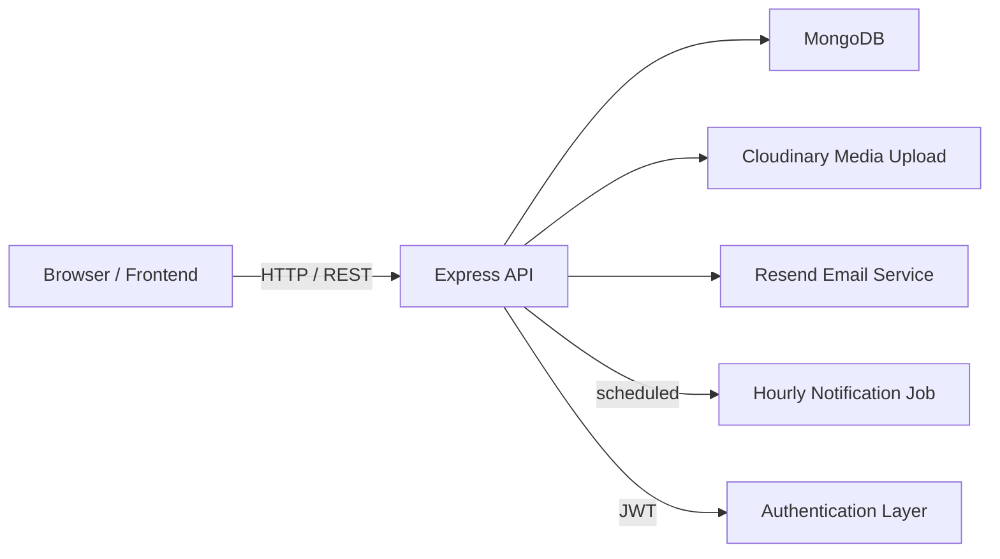

# Gram Dhara

Civic issue reporting and operations dashboard for citizens, department admins, and super admins.

<!-- Optional badges: build status, license, dependencies -->

## Overview

Gram Dhara is a full-stack civic reporting platform built with a Node.js API backend and a static frontend. Citizens can submit water and infrastructure reports with photos and voice notes, while admins review status, assign work, publish notices, and track report history.

The backend uses MongoDB for persistent data, JWT authentication for session management, and Cloudinary for file uploads. An hourly cron job supports automated reminder notifications for pending reports.

## Features

- User Experience
  - Register, login, logout, password reset flow
  - Submit reports with image upload and optional voice recording
  - View personal report history and report details
  - Receive notifications about report updates

- Admin & Operations
  - Dashboard metrics for reports and users
  - Assign reports to department officials
  - Update report status and resolve issues with completion photos
  - Publish notices and manage archived announcements
  - Role management for users and admins

- System Services
  - JWT authentication with refresh token support
  - Role-based access control (citizen, department_admin, super_admin)
  - Audit trail with report history records
  - Notification collection and email reminders
  - Analytics generation for dashboard summary
  - Cloudinary-backed media upload pipeline

## Tech Stack

| Frontend | Backend | Database | Authentication | Storage | Automation | Other |
|---|---|---|---|---|---|---|
| HTML/CSS/JS | Node.js / Express | MongoDB / Mongoose | JWT / refresh tokens | Cloudinary | node-cron | Resend Email |
| Static dashboards | ES modules | UUID-based references | bcrypt password hashing | Multer upload middleware | hourly reminder job | API client wrapper |

## Architecture Overview

The project separates frontend presentation from backend services:

- Static frontend pages call backend REST endpoints through a shared API client
- Express routes map to controller functions and Mongoose models
- Middleware enforces authentication, roles, and upload validation
- Cloudinary handles media storage and temporary files are removed after upload
- Background jobs send reminders for unresolved pending reports

## Engineering Highlights

- JWT-based authentication with access and refresh tokens
- Role-based authorization across citizen, department admin, and super admin flows
- Upload pipeline using Multer and Cloudinary for photo/audio storage
- Notification system backed by database records and email reminders
- Report history audit collection for status changes
- Analytics generation via aggregation pipelines and stored summary records
- Modular backend architecture with clear controller/route/model separation

## Project Workflow

1. Citizen registers and logs in
2. Citizen submits a report with photo and location data
3. Backend stores the report, creates history, and updates analytics
4. Department admins view reports, assign work, and change status
5. Users receive notifications when their report changes
6. Hourly cron job sends reminders for pending reports older than 48 hours
7. Admins resolve reports with completion photos and archive notices

## Folder Structure

- `backend/` – API server, models, controllers, middleware, utilities
- `frontend/` – static UI, dashboard pages, login flow, shared JS client
- `backend/src/routes/` – API route definitions
- `backend/src/controllers/` – request handling and business logic
- `backend/src/models/` – Mongoose schema definitions
- `backend/src/utils/` – Cloudinary, email, analytics, notification helpers

## Getting Started

1. Open `backend/` and install dependencies:
   - `npm install`
2. Add a `.env` file with MongoDB, JWT, Cloudinary, and Resend credentials
3. Start the backend server:
   - `npm run dev`
4. Open frontend pages directly or serve the static files from a local web server

## License

License: TBD

